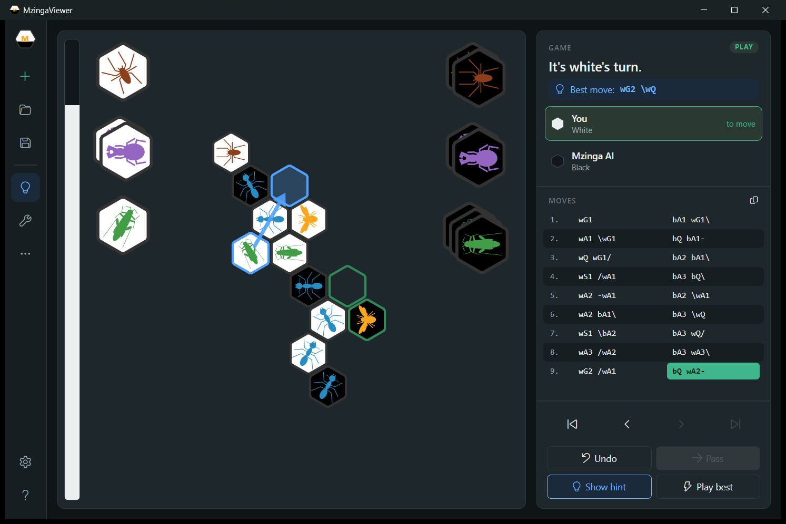
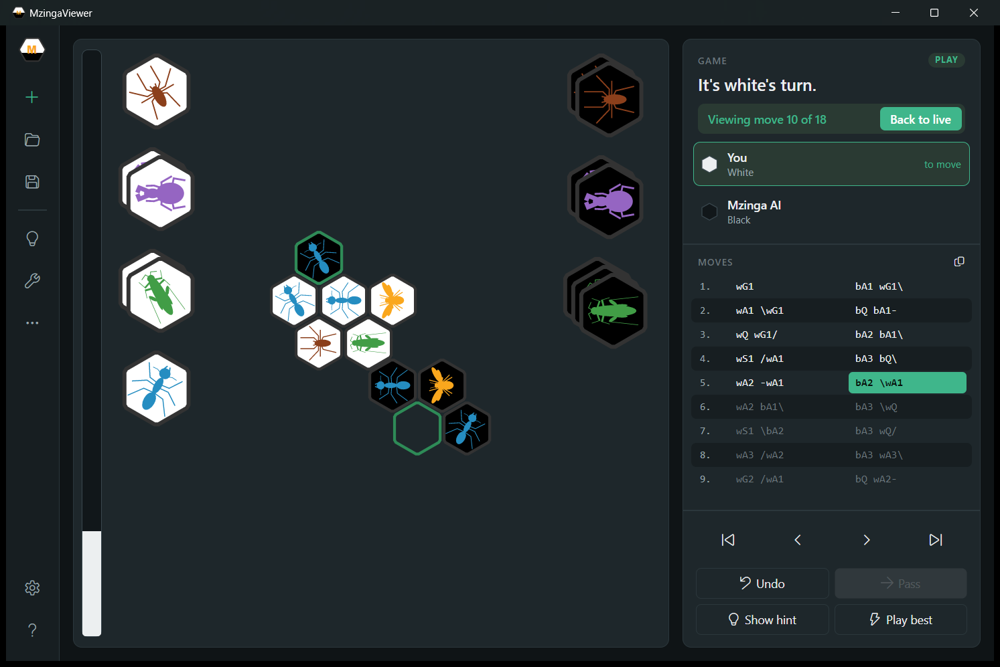

# Hive Trainer

A desktop app for learning the board game [Hive](https://gen42.com/games/hive): play against an AI, browse your games and see who is winning while you play.

**The game engine and AI come from [Mzinga](https://github.com/jonthysell/Mzinga) by Jon Thysell.** This project adds a new interface and learning tools on top of it.





## What's new compared to Mzinga

- Modern dark UI with an icon bar, game panel and two-column move list
- Live evaluation bar after every move
- Best-move hint shown on the board (**H**), without playing it
- Forced-win detection (`#N` on the evaluation bar, e.g. "Black wins in 2")
- Step through earlier positions mid-game with the arrow keys

## Run it

Requires the [.NET 8 SDK](https://dotnet.microsoft.com/download/dotnet/8.0).

```sh
git clone https://github.com/sarmyca/hive-trainer.git
cd hive-trainer/src
dotnet build Mzinga.Viewer/Mzinga.Viewer.csproj -c Release
```

Then start `src/Mzinga.Viewer/bin/Release/net8.0/MzingaViewer.exe` and create a new game with **+** (Ctrl+N).

## Credits

Engine, AI and original viewer: [Mzinga](https://github.com/jonthysell/Mzinga) © Jon Thysell, MIT License. Hive © Gen42 Games; this project is not affiliated with Gen42 Games. Licensed under MIT, see [LICENSE.md](LICENSE.md).
